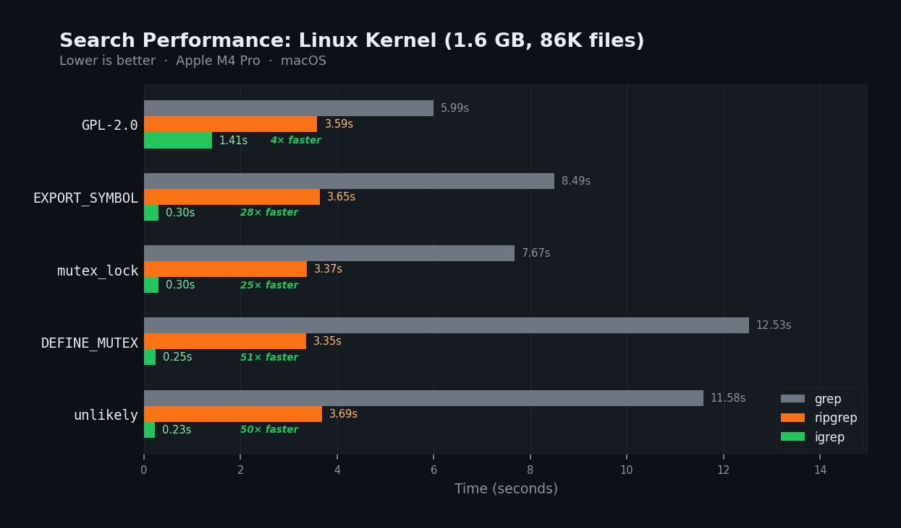

# igrep

**Blazing-fast regex search using sparse n-gram indexes.**

`igrep` builds a pre-computed index over your codebase so that regex queries return results in milliseconds instead of seconds — even on massive repositories.



## Why?

Traditional code search tools (`grep`, `ripgrep`) must scan every byte of every file on each query. For large codebases this takes seconds — too slow for interactive use.

Inspired by [Vicent Marti's blog post on how Cursor built their code search](https://cursor.com/blog/fast-regex-search), `igrep` takes a different approach: build an index once, then answer queries by reading only the files that *could* contain a match.

## How It Works

1. **N-gram extraction** — Every file is decomposed into overlapping n-grams (character sequences). Each n-gram maps to the set of files that contain it.

2. **Sparse covering set** — Rather than storing *all* n-grams from a regex pattern, `igrep` uses `build_covering` to select a minimal subset that still filters effectively. This keeps the index compact and lookups fast.

3. **Frequency weighting** — N-grams are ranked by how selective they are (rarer n-grams eliminate more candidate files). The query planner intersects posting lists for the most selective n-grams first.

4. **Memory-mapped index** — The on-disk index is `mmap`'d at query time, so the OS manages caching. No deserialization step — the index is ready to query immediately after opening.

5. **Candidate verification** — Only the candidate files identified by the index are opened and scanned with a full regex engine. For selective patterns this is often <1% of total files.

## Installation

```bash
cargo install --path crates/igrep-cli
```

This installs two binaries: `igrep-index` and `igrep`.

## Usage

### Build an index

```bash
# Index a directory (creates .igrep/ in the target directory)
igrep-index /path/to/source

# Custom output directory
igrep-index /path/to/source --output-dir /tmp/my-index

# Verbose mode
igrep-index /path/to/source --verbose
```

### Search

```bash
# Basic search
igrep 'pattern' /path/to/source

# With line numbers
igrep -n 'fn main' /path/to/source

# Case-insensitive
igrep -i 'readme' /path/to/source

# List matching files only
igrep -l 'TODO' /path/to/source

# Count matches per file
igrep -c 'import' /path/to/source

# Filter by filename regex
igrep -f '\.rs$' 'fn main' /path/to/source

# Custom index location
igrep --index-dir /tmp/my-index 'pattern' /path/to/source
```

## Benchmarks

Searching the Linux kernel v6.12.17 (1.6 GB across 86,618 files):

| Pattern | `grep -r` | `ripgrep` | **`igrep`** | vs grep | vs ripgrep |
|---------|-----------|-----------|-------------|---------|------------|
| `EXPORT_SYMBOL` | 8.50s | 3.65s | **0.30s** | 28× | 12× |
| `mutex_lock` | 7.67s | 3.37s | **0.30s** | 25× | 11× |
| `DEFINE_MUTEX` | 12.53s | 3.36s | **0.25s** | 51× | 14× |
| `GPL-2.0` | 5.99s | 3.59s | **1.41s** | 4× | 3× |
| `unlikely` | 11.58s | 3.69s | **0.23s** | 50× | 16× |

<details>
<summary>Test conditions</summary>

- **Corpus**: Linux kernel v6.12.17 — 1.6 GB, 86,618 files
- **Machine**: Apple M4 Pro, 24 GB RAM, macOS
- **Index build time**: 369 seconds
- **Index size on disk**: 948 MB
- **Tool**: [hyperfine](https://github.com/sharkdp/hyperfine) with 3 warmup runs, 5 measured runs
- `grep -rn` (GNU grep), `rg` (ripgrep 14), `igrep` (this project)

</details>

`GPL-2.0` shows a smaller speedup because it appears in the `COPYING` file and license headers across most files, so the index can't narrow the candidate set as aggressively.

## Architecture

The project is split into two crates:

### `igrep-core`

The library crate containing all indexing and search logic:

| Module | Purpose |
|--------|---------|
| `ngram` | N-gram extraction and representation |
| `trigram` | Trigram-specific utilities |
| `frequency_table` | N-gram frequency statistics for query optimization |
| `query` | Regex → n-gram query plan conversion |
| `posting` | Posting list storage and intersection |
| `index::writer` | Build and serialize the index to disk |
| `index::reader` | Memory-mapped index reader |
| `search` | End-to-end search: index lookup → candidate verification |
| `walker` | File system traversal (respects `.gitignore` via `ignore` crate) |
| `git_overlay` | Git-aware features (commit SHA tracking) |
| `types` | Shared configuration and type definitions |

### `igrep-cli`

Two thin CLI binaries built with [clap](https://github.com/clap-rs/clap):

- **`igrep-index`** — Walks directories, builds the n-gram index, writes it to disk
- **`igrep`** — Loads the index, runs a query, prints results

## Credits

- [Vicent Marti — "Fast regex search: indexing text for agent tools" (Cursor blog)](https://cursor.com/blog/fast-regex-search) — the inspiration for this project's approach to code search indexing
- [google/codesearch](https://github.com/google/codesearch) — Russ Cox's original trigram-based code search tool
- [danlark1/sparse_ngrams](https://github.com/danlark1/sparse_ngrams) — research on sparse n-gram indexes for approximate string matching

## License

MIT
